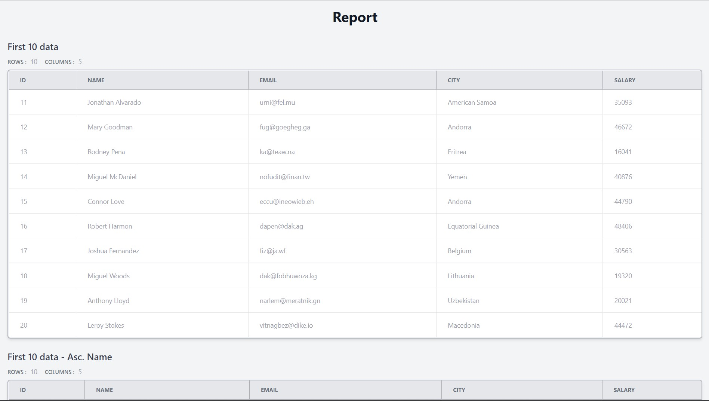

# SQL Automation

This is a simple tool to run a set of sql queries and generate a HTML report of the results

# How to use the tool

- Clone the repo.
- Copy `.env` as `.env.local` and replace the values
  ```
  TEMPLATES_PATH="Path to templates dir"
  DB_PATH="Path to database"
  REPORT_PATH="Path to reports dir"
  MAX_THREADS=10
  ```
  absolute paths are always reliable
- Create a json file with the following schema

  ```json
  {
    "type": "array",
    "items": {
      "type": "object",
      "required": ["name", "query"],
      "properties": {
        "name": {
          "type": "string",
          "pattern": "^._$"
        },
        "query": {
          "type": "string",
          "pattern": "^._$"
        }
      }
    }
  }
  ```

  > Example

  ```json
  [
    {
      "name": "First 10 data",
      "query": "select * from Person limit 10"
    },
    {
      "name": "First 10 data - Asc. Name",
      "query": "select * from Person order by name limit 10"
    }
  ]
  ```

- run the program with the following command
  > python main.py [query.json] [report title]
  ```bash
  python main.py query.json
              or
  python3 main.py query.json
  ```

# Report Examples



# Possible Updates

- Currently the tool is intended to work on `sqlite`, may be updated to other databases
  > It can be accomplished by writing new context manager
- Errors in the queries are not taken into account
